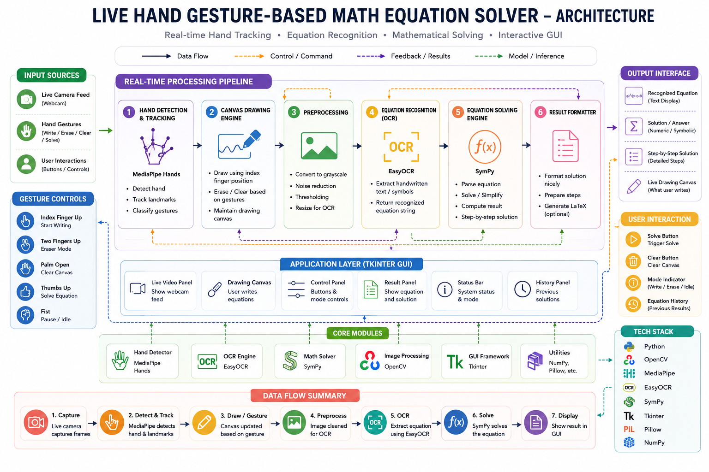

# Live Hand Gesture-Based Math Equation Solver

An AI-powered system that recognizes and solves handwritten math equations in real-time using hand gestures. Built with MediaPipe for hand tracking, OpenCV for image processing, EasyOCR for OCR, and SymPy for equation solving. Features a Tkinter GUI for live interaction and accessibility.

##  Features
- Real-time hand gesture tracking
- OCR for handwritten equations
- Instant equation solving
- Gesture-based controls for writing, erasing, and clearing
- Tkinter GUI with live camera feed

## Tech Stack
- **Languages:** Python
- **Libraries:** OpenCV, MediaPipe, EasyOCR, SymPy, Pillow
- **GUI:** Tkinter

##  Project Structure
app.py # Main GUI Application
math_recognizer.py # OCR & Equation Solver
hand_detector.py # Hand Tracking Logic
requirements.txt # Dependencies
## Architecture

##  How to Run
```bash
git clone https://github.com/yourusername/Live_Hand_Gesture_Based_Math_Equation_Solver.git
cd Live_Hand_Gesture_Based_Math_Equation_Solver
.venv\Scripts\activate
pip install -r requirements.txt
python src\app.py
```
snapshots


